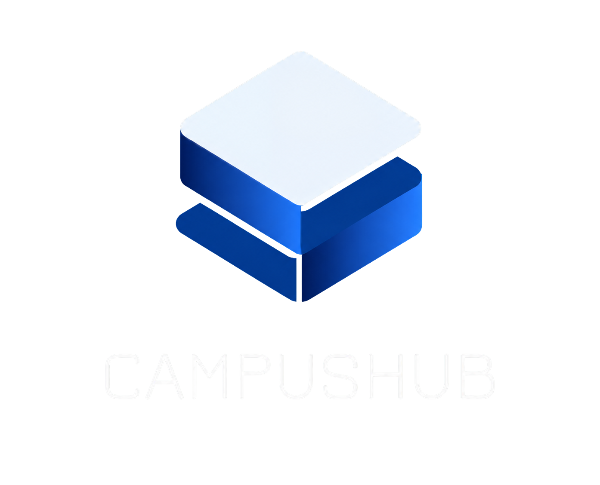
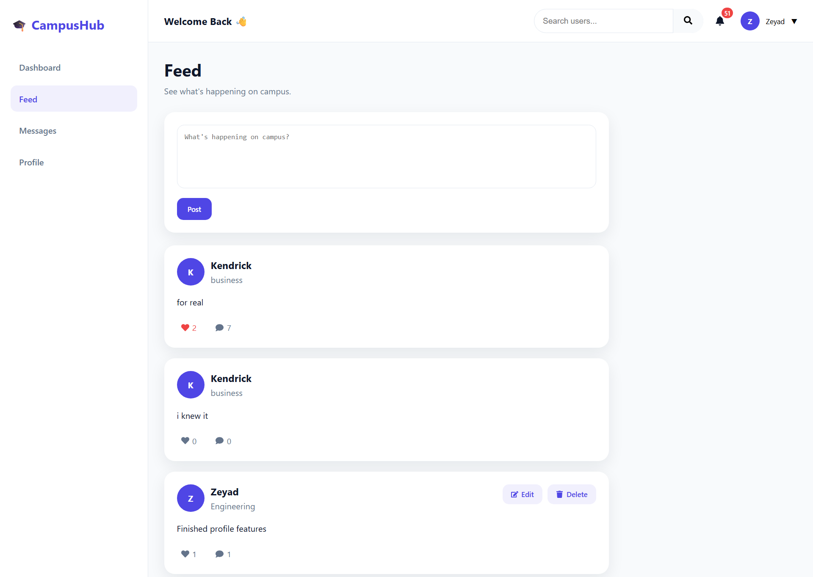
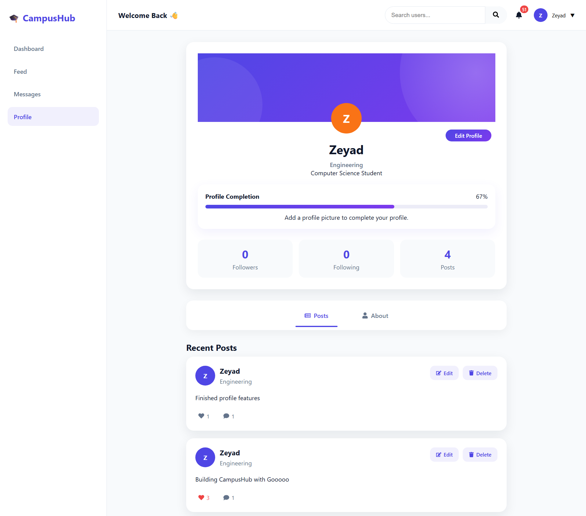
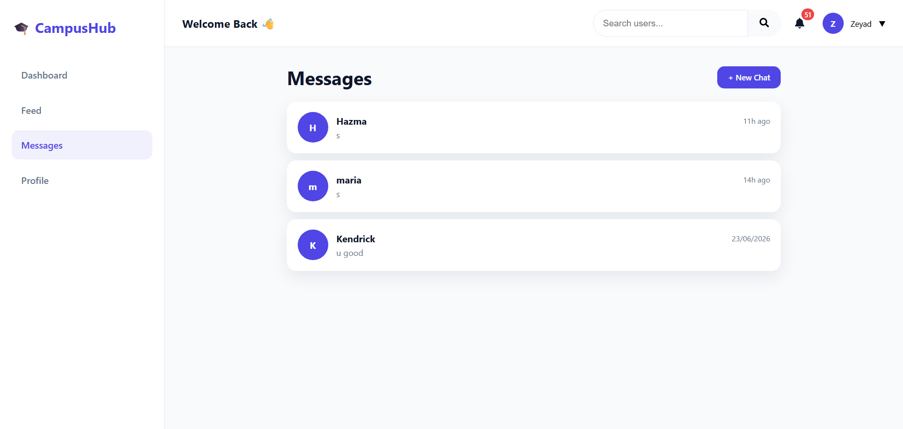
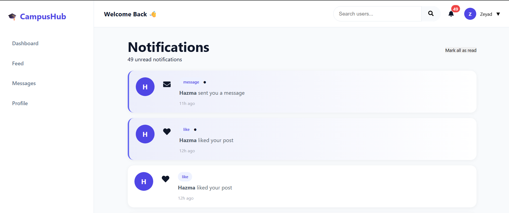

# 🎓 CampusHub

<p align="center">
  
</p>

<p align="center">
  A Modern Social Networking Platform Built For University Communities
</p>

<p align="center">


</p>

<p align="center">
  <strong>React • Go • PostgreSQL • WebSockets • JWT • Supabase • Vercel • Render</strong>
</p>

---

# 🚀 Overview

CampusHub is a full-stack social networking platform designed specifically for university communities.

The platform allows students to create and interact with posts, follow other users, manage profiles, exchange real-time messages, receive notifications, share images and GIFs, and communicate through a modern responsive interface.

The application combines a **React + Vite frontend** with a **Go backend API**, **PostgreSQL**, **Supabase Storage**, and **WebSockets** to provide a complete real-time social networking experience.

---

# 🌐 Live Demo

### Frontend

🔗 https://campushub-eta-wheat.vercel.app/

### Backend API

🔗 https://campushub-backend-1an6.onrender.com/

### Health Check

🔗 https://campushub-backend-1an6.onrender.com/health

### ⚠️ Free-Tier Cold Start

The backend is hosted on Render's free tier.

After a period of inactivity, the backend may enter a sleep state. The first request can therefore take approximately **10–60 seconds** while the server wakes up.

If the application appears slow during the first login or request:

1. Wait a few moments.
2. Refresh once if necessary.
3. Continue normally once the backend is awake.

Subsequent requests should be significantly faster while the server remains active.

This behavior is related to the hosting environment and does not occur during local development.

---

# 🏗️ Architecture

```text
User
 ↓
React Frontend
(Vercel)
 ↓
REST API + WebSockets
 ↓
Go Backend
(Render)
 ↓
PostgreSQL + Storage
(Supabase)
```

---

# ✨ Features

## 🔐 Authentication

- User Registration
- User Login
- JWT Authentication
- Protected Routes
- Persistent Sessions
- Change Password

## 📰 Social Feed

- Create Posts
- Edit Posts
- Delete Posts
- View Feed
- Real-Time Post Updates
- Image Uploads
- GIF Support
- Emoji Support

## ❤️ Social Interactions

- Like Posts
- Unlike Posts
- Comments
- Emoji Support
- Real-Time Likes
- Real-Time Comments

## 👤 User Profiles

- Public Profiles
- Profile Editing
- Avatar Uploads
- Avatar Removal
- Faculty Information
- Bio Management
- User Activity
- Profile Completion

## 👥 Social Network

- Follow Users
- Unfollow Users
- Follow Requests
- Accept Follow Requests
- Reject Follow Requests
- Cancel Follow Requests
- Followers Statistics
- Following Statistics
- Follow Status

## 💬 Real-Time Messaging

- Direct Messaging
- Real-Time Conversations
- Image Sharing
- GIF Support
- Emoji Support
- Typing Indicators
- Read Receipts
- Online Status
- Last Seen
- Unread Message Tracking
- Conversation Management

## 🔔 Notifications

- Real-Time Notifications
- Follow Notifications
- Follow Request Notifications
- Like Notifications
- Comment Notifications
- Notification Counters
- Read / Unread Tracking
- Mark All as Read

## 🌙 Personalization

- Dark Mode
- User Preferences
- Privacy Controls
- Notification Settings
- Account Settings
- Password Management

---

# ⚡ Real-Time Features

CampusHub uses WebSockets to provide a live interactive experience.

```text
• Live Messaging
• Typing Indicators
• Read Receipts
• Online User Tracking
• Last Seen Updates
• Real-Time Notifications
• Follow Request Updates
• Like Updates
• Comment Updates
• New Post Broadcasting
```

---

# 🛠️ Tech Stack

| Technology | Purpose |
|------------|---------|
| React | Frontend Framework |
| Vite | Build Tool |
| React Router DOM | Client-Side Routing |
| Tailwind CSS | Utility-First Styling |
| shadcn/ui | UI Components |
| Base UI | Component Primitives |
| Framer Motion | Animations |
| Lucide React | Icons |
| Axios | API Communication |
| Context API | Global State Management |
| WebSocket API | Real-Time Communication |
| Go | Backend API |
| Chi Router | Backend Routing |
| PostgreSQL | Database |
| JWT | Authentication |
| Supabase | Database & Storage |
| Render | Backend Hosting |
| Vercel | Frontend Hosting |
| Giphy | GIF Search |

---

# 📁 Project Structure

```text
campushub/
├── frontend/
│   ├── public/
│   ├── src/
│   │   ├── components/
│   │   ├── contexts/
│   │   ├── pages/
│   │   ├── services/
│   │   ├── styles/
│   │   ├── utils/
│   │   ├── App.jsx
│   │   └── main.jsx
│   ├── .env.example
│   ├── index.html
│   ├── package.json
│   └── vite.config.js
│
├── backend/
│   ├── cmd/
│   ├── docs/
│   ├── internal/
│   ├── migrations/
│   ├── Dockerfile
│   ├── docker-compose.yml
│   ├── .env.example
│   ├── go.mod
│   └── README.md
│
└── README.md
```

---

# 📸 Application Preview

### 📰 Feed



### 👤 Profile



### 💬 Messaging



### 🔔 Notifications



---

# ⚙️ Environment Variables

## Frontend — Local Development

Create:

```text
frontend/.env.local
```

Example:

```env
VITE_API_URL=http://localhost:8080
VITE_WS_URL=localhost:8080
VITE_GIPHY_API_KEY=your_giphy_api_key
```

## Frontend — Production

Production configuration should point to the deployed backend:

```env
VITE_API_URL=https://your-backend-url.com
VITE_WS_URL=your-backend-url.com
VITE_GIPHY_API_KEY=your_giphy_api_key
```

Production environment variables can be configured through the frontend hosting platform.

> `VITE_*` variables are exposed to the browser. Never place database passwords, JWT secrets, Supabase service keys, or other backend secrets in the frontend environment.

## Backend

Backend environment variables are documented in:

```text
backend/.env.example
```

---

# 🚀 Local Development

## Frontend

Navigate to the frontend:

```bash
cd frontend
```

Install dependencies:

```bash
npm install
```

Start the development server:

```bash
npm run dev
```

The frontend runs at:

```text
http://localhost:5173
```

## Backend

Navigate to the backend:

```bash
cd backend
```

Install Go dependencies:

```bash
go mod download
```

Start the API:

```bash
go run cmd/main.go
```

The backend runs at:

```text
http://localhost:8080
```

---

# 🐳 Backend With Docker

From the backend directory:

```bash
docker compose up --build
```

To stop the environment:

```bash
docker compose down
```

---

# 🌍 Deployment

| Layer | Platform |
|-------|----------|
| Frontend | Vercel |
| Backend | Render |
| Database | Supabase PostgreSQL |
| Storage | Supabase Storage |

The frontend communicates with the deployed backend over HTTPS and WebSockets.

---

# 🔗 API Documentation

The backend includes Swagger documentation.

Local Swagger:

```text
http://localhost:8080/swagger/index.html
```

Production API:

```text
https://campushub-backend-1an6.onrender.com/
```

---

# 🔒 Security

The project keeps sensitive backend credentials server-side.

Never commit:

```text
.env
Database passwords
JWT secrets
Supabase service keys
Production credentials
```

Use `.env.example` files to document required configuration without exposing secrets.

---

# 🎯 Learning Outcomes

CampusHub demonstrates practical experience with:

- Modern React Development
- Component-Based Architecture
- Responsive UI Development
- Tailwind CSS
- shadcn/ui
- Framer Motion
- Client-Side Routing
- REST API Integration
- JWT Authentication
- WebSocket Communication
- Real-Time Application Design
- Context API State Management
- PostgreSQL
- Supabase
- Docker
- Cloud Deployment
- Production Environment Configuration

---

# 🔮 Future Improvements

Potential future improvements include:

- Stories System
- Group Messaging
- Push Notifications
- Mobile Application
- Progressive Web App
- Offline Support
- Friend Recommendation Engine
- Advanced Analytics
- Further Accessibility Improvements
- Additional Performance Optimization

---

# 👨‍💻 Author

**Zeyad Badawy**

Full-Stack Developer | Software Engineer

### Links

🔗 GitHub  
https://github.com/zeyadbadawyy

🔗 Repository  
https://github.com/zeyadbadawyy/campushub

---

<p align="center">
  Built with ❤️ using React, Go, PostgreSQL, WebSockets, Supabase, Render, and Vercel.
</p>