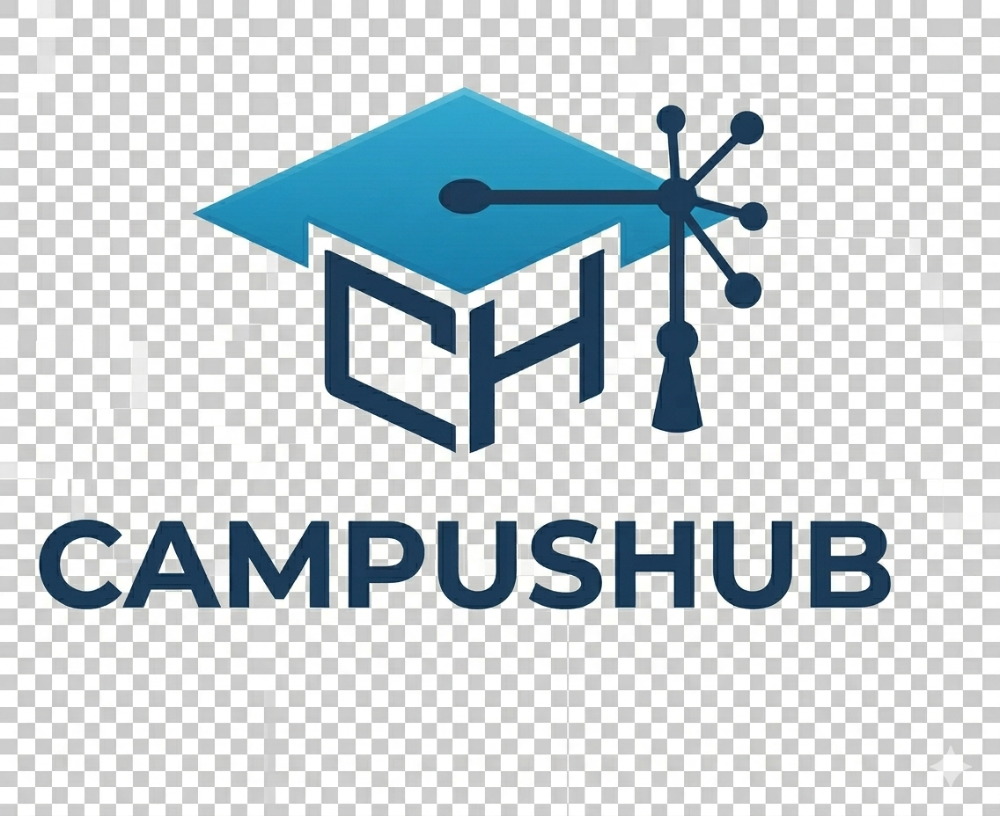
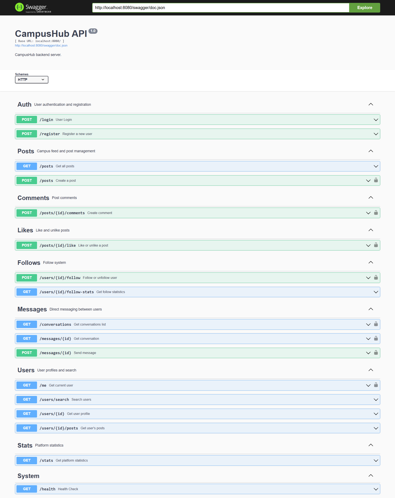
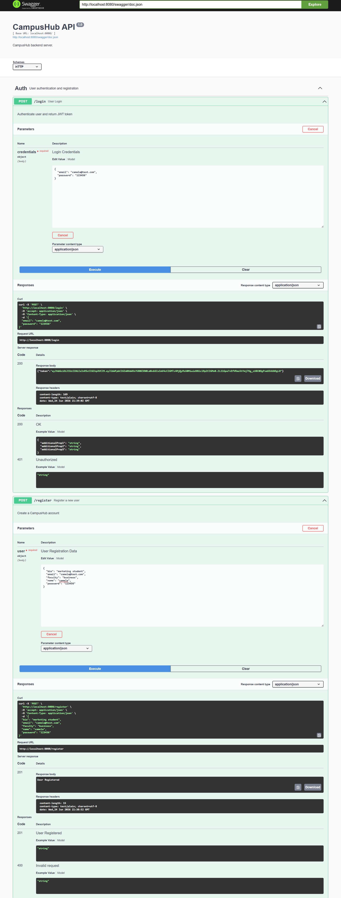
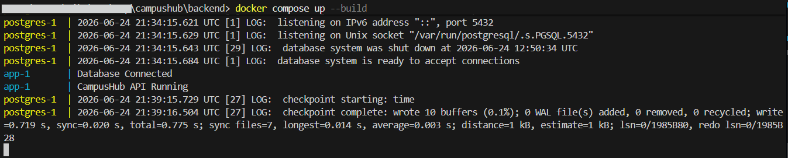

<p align="center">
  
</p>

<h1 align="center">CampusHub</h1>

<p align="center">
  Modern Social Networking Backend API for University Communities
</p>

<p align="center">


</p>

# 🚀 CampusHub

CampusHub is a modern social networking backend API built with Go, PostgreSQL, JWT Authentication, Swagger Documentation, and Docker.

The project simulates the backend of a university-focused social platform where students can create posts, interact with each other, follow users, and exchange direct messages.

---

## 🏗️Architecture

CampusHub follows a layered backend architecture:

Client
↓
REST API
↓
Middleware (JWT Authentication)
↓
Handlers
↓
Database Layer
↓
PostgreSQL

---

## ✨ Features

### 🔐 Authentication
- User Registration
- User Login
- JWT Authentication
- Protected Routes
- Current User Endpoint

### 👤 User Management
- User Profiles
- Search Users
- Follow / Unfollow Users
- Followers & Following Statistics

### 📝 Posts
- Create Posts
- View Posts
- Update Posts
- Delete Posts

### 💬 Comments
- Add Comments
- View Comments
- Delete Comments

### ❤️ Likes
- Like Posts
- Unlike Posts

### 📩 Messaging
- Send Direct Messages
- View Conversations
- Retrieve Chat History

### 📊 System Features
- Platform Statistics
- Health Check Endpoint
- Swagger API Documentation

### 🐳 DevOps
- Dockerized Application
- PostgreSQL Container
- Database Migrations
- Environment Configuration

---

## 🛠️ Tech Stack

| Technology | Purpose |
|------------|----------|
| Go | Backend API |
| PostgreSQL | Database |
| Chi Router | Routing |
| JWT | Authentication |
| Swagger | API Documentation |
| Docker | Containerization |

---

## 📸Snippets

### Swagger Documentation



### Authentication Endpoints



### Docker Deployment



---

## 📁 Project Structure

```text
backend/
├── cmd/
├── docs/
├── internal/
│   ├── database/
│   ├── handlers/
│   ├── middleware/
│   ├── models/
│   ├── routes/
│   └── utils/
├── migrations/
├── Dockerfile
├── docker-compose.yml
├── .env.example
└── README.md

---

## ⚡ Running Locally

```bash
go mod download
go run cmd/main.go
```

---

## 🐳 Running With Docker

```bash
docker compose up --build
```

---

## 📖 Swagger Documentation

After starting the application:

```text
http://localhost:8080/swagger/index.html
```

---

## ❤️ Health Check

```http
GET /health
```

Response:

```json
{
  "status": "ok"
}
```

---

## 🔮 Future Roadmap

### Planned Frontend

A full React frontend is planned for a future version of CampusHub.

The frontend will include:

- User Authentication UI
- Campus Feed
- User Profiles
- Likes & Comments
- Follow System
- Direct Messaging Interface
- Responsive Design

This will transform CampusHub from a backend API project into a complete full-stack social networking platform.

---

## 📈 Future Improvements

- WebSocket Real-Time Chat
- Push Notifications
- Media Uploads
- User Avatars
- Feed Pagination
- Role-Based Access Control
- Admin Dashboard

---

## 👨‍💻 Author

**Zeyad Badawy**

*Full-Stack Developer | Software Engineer*

Built as a portfolio project to demonstrate backend development, API design, authentication, database management, documentation, and containerized deployment using Go.