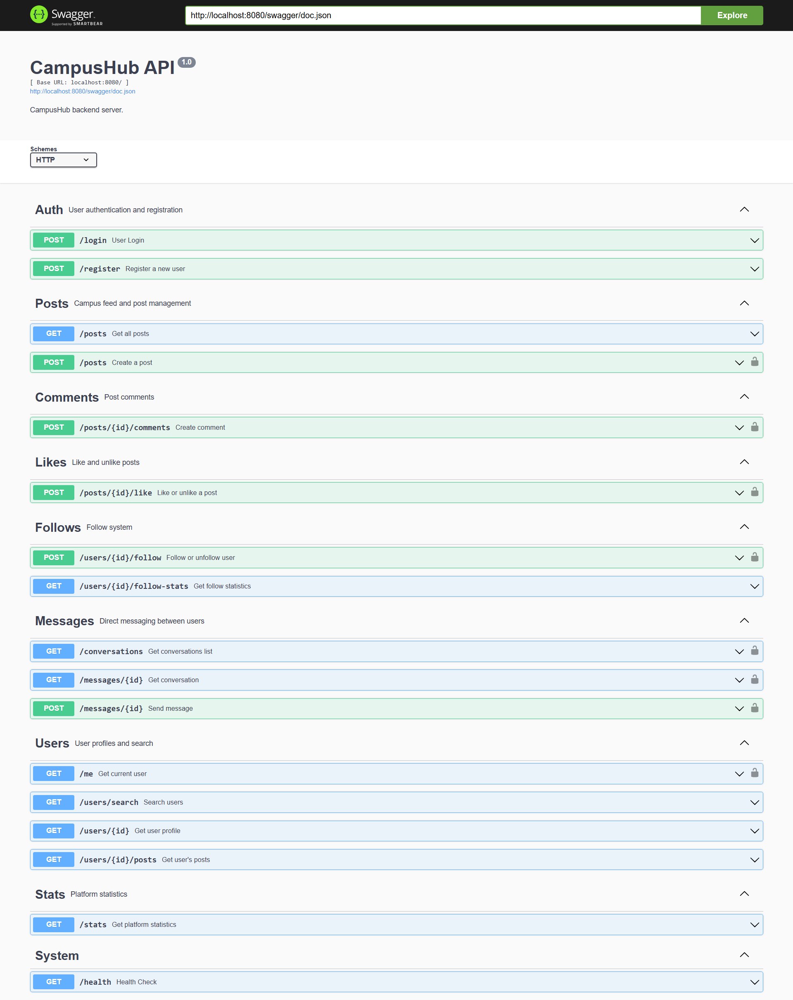
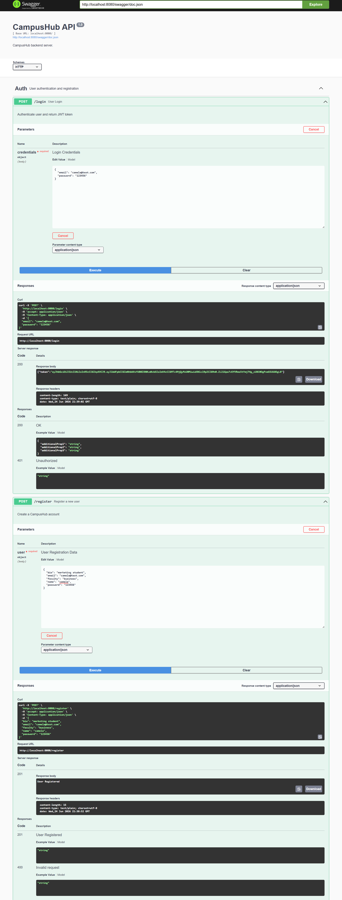
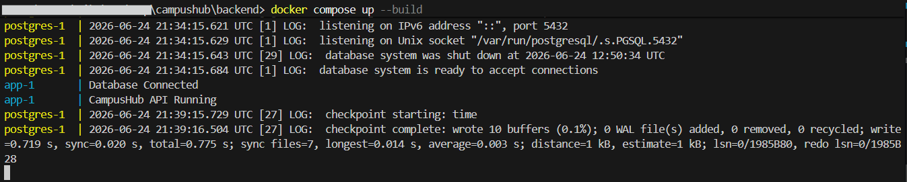

<p align="center">
  
</p>

<h1 align="center">CampusHub Backend</h1>

<p align="center">
  Modern Social Networking REST API for University Communities
</p>

<p align="center">


</p>

---

# 🚀 Overview

CampusHub Backend is a full-featured social networking API built with **Go and PostgreSQL**, designed for university communities.

The API provides authentication, user management, social interactions, posts, comments, likes, follows, direct messaging, notifications, real-time communication, and supporting system endpoints.

The backend is designed to operate independently as an API and can be consumed by any compatible frontend or client application.

---

# 🏗️ Architecture

CampusHub follows a layered backend architecture:

```text
Client
   ↓
REST API / WebSocket
   ↓
Middleware
   ↓
Handlers
   ↓
Application Logic
   ↓
Database Layer
   ↓
PostgreSQL
```

---

# ✨ Features

## 🔐 Authentication

- User Registration
- User Login
- JWT Authentication
- Protected Routes
- Current User Endpoint
- Password Management

## 👤 User Management

- User Profiles
- Profile Updates
- User Search
- Follow / Unfollow
- Follow Requests
- Followers Statistics
- Following Statistics
- User Visibility
- User Activity

## 📝 Posts

- Create Posts
- View Posts
- Retrieve Individual Posts
- Update Posts
- Delete Posts

## 💬 Comments

- Create Comments
- View Comments
- Delete Comments

## ❤️ Likes

- Like Posts
- Unlike Posts
- Real-Time Like Updates

## 🤝 Social Network

- Follow Users
- Unfollow Users
- Follow Requests
- Accept Follow Requests
- Reject Follow Requests
- Cancel Follow Requests
- Follow Status

## 📩 Messaging

- Direct Messages
- Conversations
- Chat History
- Message Status
- Unread Message Tracking
- Real-Time Messaging

## 🔔 Notifications

- Follow Notifications
- Like Notifications
- Comment Notifications
- Follow Request Notifications
- Unread Notification Tracking
- Notification Read Status

## ⚡ Real-Time Communication

WebSockets are used for real-time platform events including:

- New Messages
- Typing Indicators
- Read Receipts
- Online Status
- Notifications
- Follow Requests
- Comments
- Likes
- New Post Broadcasting

## 📊 System Features

- Health Check Endpoint
- Platform Statistics
- Swagger API Documentation
- Database Migrations
- Environment-Based Configuration

## 🐳 DevOps

- Dockerized Application
- Docker Compose
- PostgreSQL Container Support
- Database Migrations
- Production Environment Configuration

---

# 🛠️ Tech Stack

| Technology | Purpose |
|------------|---------|
| Go | Backend API |
| Chi Router | HTTP Routing |
| PostgreSQL | Application Database |
| JWT | Authentication |
| WebSockets | Real-Time Communication |
| Swagger | API Documentation |
| Docker | Containerization |
| Docker Compose | Local Development |

---

# 📸 API Documentation

### Swagger Documentation



### Authentication Endpoints



### Docker Environment



---

# 📁 Project Structure

```text
backend/
├── cmd/
├── docs/
├── internal/
│   ├── database/
│   ├── handlers/
│   ├── middleware/
│   ├── models/
│   ├── routes/
│   └── utils/
├── migrations/
├── Dockerfile
├── docker-compose.yml
├── .env.example
├── go.mod
└── README.md
```

---

# 🔐 Environment Variables

Create a `.env` file for local development.

Example:

```env
PORT=8080

DB_HOST=localhost
DB_PORT=5432
DB_USER=postgres
DB_PASSWORD=your_password
DB_NAME=campushub
DB_SSLMODE=disable

JWT_SECRET=your_jwt_secret

SUPABASE_URL=your_supabase_url
SUPABASE_SERVICE_KEY=your_supabase_service_role_key
```

> Never commit real credentials or secrets. Use `.env.example` as the configuration template.

---

# ⚡ Running Locally

Install dependencies:

```bash
go mod download
```

Start the API:

```bash
go run cmd/main.go
```

The server will run on:

```text
http://localhost:8080
```

---

# 🐳 Running With Docker

Build and start the application:

```bash
docker compose up --build
```

To run in the background:

```bash
docker compose up -d --build
```

Stop the containers:

```bash
docker compose down
```

---

# 📖 Swagger Documentation

After starting the backend, open:

```text
http://localhost:8080/swagger/index.html
```

Swagger provides interactive API documentation and allows available endpoints to be tested directly.

---

# ❤️ Health Check

### Request

```http
GET /health
```

### Response

```json
{
  "status": "ok"
}
```

---

# 🔌 WebSocket Endpoint

The backend exposes a WebSocket endpoint for real-time communication:

```text
ws://localhost:8080/ws
```

The WebSocket layer handles real-time messaging and platform events such as typing indicators, read receipts, notifications, presence updates, likes, comments, follow requests, and new post broadcasts.

---

# 🌍 Production Deployment

The production backend is deployed on **Render**.

Production environment variables are configured directly through the hosting platform.

The backend connects to the production PostgreSQL database hosted through **Supabase**.

```text
Client
   ↓
CampusHub API
   ↓
Go Backend
   ↓
Supabase PostgreSQL
```

---

# 🔒 Security

The API uses JWT-based authentication for protected routes.

Sensitive values must remain outside version control, including:

```text
.env
Database passwords
JWT secrets
Supabase service keys
Production credentials
```

---

# 👨‍💻 Author

**Zeyad Badawy**

Full-Stack Developer | Software Engineer

GitHub:  
https://github.com/zeyadbadawyy